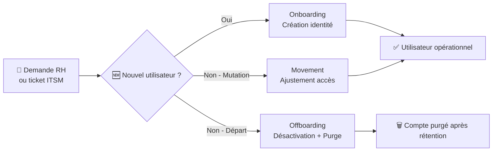
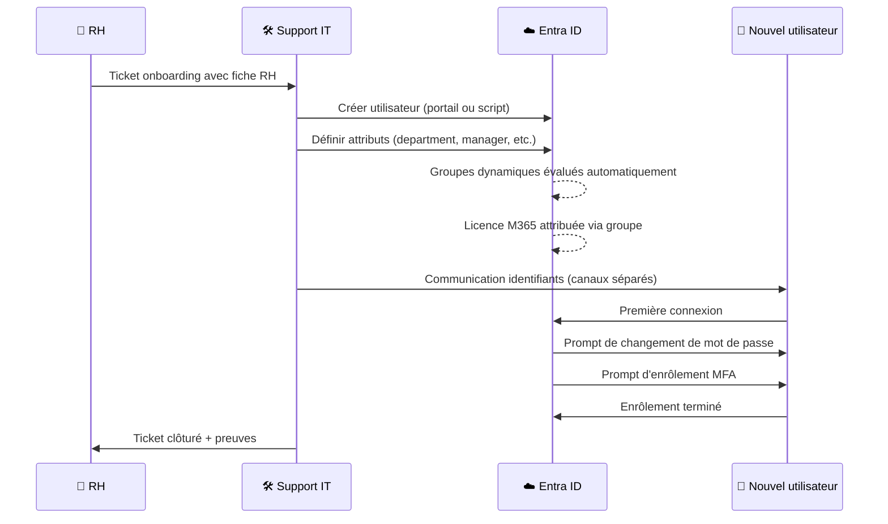
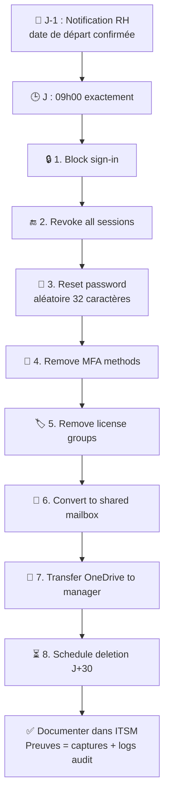

# Fiche 1 — Entra ID : Cycle de vie des utilisateurs

<aside>
📝

**Fiche technique #1** — À copier dans le fichier `01-entra-id-cycle-de-vie.md` du dépôt GitHub `tech-notes-iam-support`.

Contenu ci-dessous écrit en Markdown standard, compatible avec l'affichage GitHub.

</aside>

---

# 🔐 Cycle de vie des utilisateurs sur Microsoft Entra ID

> Fiche technique de référence — Procédures opérationnelles pour gérer les identités dans un tenant Microsoft Entra ID (ex-Azure AD), de l'onboarding au départ.
> 

**Auteur :** Daniel ASSOU ZIKPO

**Dernière mise à jour :** 2026-08

**Contexte :** préparation certification Microsoft SC-300

**Sources principales :** [Microsoft Learn — Entra ID documentation](https://learn.microsoft.com/en-us/entra/), [Microsoft Learn — SC-300 study guide](https://learn.microsoft.com/en-us/credentials/certifications/identity-and-access-administrator/)

---

## 📋 Sommaire

1. Contexte et enjeux
2. Concepts clés à connaître
3. Onboarding — Création et intégration d'un nouvel utilisateur
4. Mobilité interne — Changement de poste ou de département
5. Offboarding — Départ d'un collaborateur
6. Automatisation avec PowerShell / Microsoft Graph
7. Bonnes pratiques et pièges à éviter
8. Questions d'entretien types
9. Sources et pour aller plus loin

---

## 1. 🎯 Contexte et enjeux

Dans une entreprise moderne, la gestion du cycle de vie des identités (**Identity Lifecycle Management, ILM**) est une responsabilité quotidienne clé pour les équipes IT et sécurité. Un cycle de vie mal géré = risque de sécurité majeur : anciens employés toujours actifs, licences gaspillées, comptes fantômes exploitables par attaquants.

**Les 3 événements structurants du cycle :**

- **Joiners** (arrivées) : créer l'identité, provisionner les accès
- **Movers** (mobilités) : ajuster les accès selon le nouveau rôle
- **Leavers** (départs) : révoquer les accès de manière sécurisée et tracaçable

**Impact business :**

- 🔐 Sécurité : réduction de la surface d'attaque
- 💰 Financier : optimisation des coûts de licences (M365 E5 ~ 55€/mois/utilisateur)
- 📋 Conformité : traçabilité exigée par ISO 27001, RGPD, PSSI internes

---

## 2. 🧩 Concepts clés

### Tenant Entra ID

Un **tenant** est une instance dédiée du service Entra ID pour une organisation. Chaque tenant a :

- Un **identifiant unique** (Tenant ID au format GUID)
- Un **domaine par défaut** (ex. `contoso.onmicrosoft.com`)
- Optionnellement un ou plusieurs **domaines personnalisés vérifiés** (ex. `contoso.com`)

### Types de comptes utilisateurs

| Type | Description | Cas d'usage typique |
| --- | --- | --- |
| **Member** | Utilisateur interne à l'organisation | Employé permanent |
| **Guest** | Utilisateur externe invité (B2B) | Prestataire, consultant |
| **Cloud-only** | Créé directement dans Entra ID | Petite structure sans AD On-Premise |
| **Synced (Hybrid)** | Synchronisé depuis un Active Directory On-Premise via AD Connect | Grande entreprise avec infrastructure hybride |

### Attributs clés d'un utilisateur

Ces attributs sont utilisés pour la gestion dynamique des groupes et l'application des politiques :

- `userPrincipalName` (UPN) — identifiant de connexion (ex. `daniel.assou@contoso.com`)
- `displayName` — nom affiché
- `department` — département (clé pour les groupes dynamiques)
- `jobTitle` — intitulé du poste
- `manager` — référence vers le responsable
- `usageLocation` — obligatoire avant d'attribuer une licence M365
- `accountEnabled` — true/false, active ou désactive le compte

### Schéma du cycle de vie



---

## 3. 🆕 Onboarding — Création d'un nouvel utilisateur

### Prem-requis

- Compte administrateur avec rôle **User Administrator** minimum
- Ticket ou demande formelle validant l'arrivée (traçabilité)
- Informations RH : nom, prénom, poste, département, manager, date de début, lieu

### 📸 Où voir les captures d'écran officielles de chaque étape

Je m'appuie sur les pages Microsoft Learn suivantes (les captures y sont directement intégrées) :

- **Création utilisateur (interne)** → [How to create, invite and delete users](https://learn.microsoft.com/en-us/entra/fundamentals/how-to-create-delete-users)
- **Portail Entra Admin Center** → [Microsoft Entra admin center](https://learn.microsoft.com/en-us/entra/fundamentals/entra-admin-center)
- **Assignment des licences par groupe** → [Assign licenses to a group](https://learn.microsoft.com/en-us/microsoft-365/admin/manage/manage-group-licenses)

### Procédure via le portail Entra Admin Center

1. Aller sur `https://entra.microsoft.com`
2. Menu **Users → All users → + New user → Create new user**
3. Onglet **Basics** :
    - **User principal name** : `prenom.nom@domaine.com`
    - **Display name** : `Prénom Nom`
    - **Password** : choisir *Auto-generate* + cocher *User must change password on next sign-in*
4. Onglet **Properties** :
    - **First name / Last name / Job title / Department / Manager / Office location / Usage location** → remplir tous les champs
    - L'**Usage location** est OBLIGATOIRE pour pouvoir attribuer une licence M365 ensuite
5. Onglet **Assignments** :
    - Optionnel à cette étape (l'affectation aux groupes se fera par les groupes dynamiques basés sur le département)
6. **Review + create**

### Post-création

| Étape | Action | Comment |
| --- | --- | --- |
| 1 | Attribuer la licence M365 | Via groupe de licence dynamique (recommandé) ou manuellement |
| 2 | Enrôlement MFA | Envoyer instructions à l'utilisateur pour installer Microsoft Authenticator |
| 3 | Communiquer identifiants | Via canal sécurisé (SMS + email séparés, jamais dans le même message) |
| 4 | Vérifier premier login | Confirmer que MFA s'enrôle, que Outlook/Teams s'ouvrent |
| 5 | Documenter dans l'ITSM | Clôturer le ticket avec captures des étapes |

### Diagramme d'onboarding



---

## 4. 🔄 Mobilité interne — Changement de poste

### Scénario type

Julie était au département Finance, elle rejoint l'IT en tant que Support Engineer. Son manager change aussi.

### Procédure

1. **Recevoir la demande de mobilité** (RH via ticket ITSM)
2. **Mettre à jour les attributs de l'utilisateur** dans Entra Admin Center :
    - `department` : Finance → IT
    - `jobTitle` : Comptable → Support Engineer
    - `manager` : ancien manager → nouveau manager
3. **Attendre la réévaluation des groupes dynamiques** (peut prendre quelques minutes) :
    - L'utilisateur sort automatiquement de `SG-Department-Finance`
    - L'utilisateur entre automatiquement dans `SG-Department-IT`
4. **Gérer les accès statiques** (groupes assigned) :
    - Retirer des groupes métier de l'ancien poste (ex. `SG-App-SAP-Compta`)
    - Ajouter aux groupes métier du nouveau poste (ex. `SG-App-ITSM-Admins`)
5. **Révoquer les sessions en cours** pour forcer une reconnexion avec les nouveaux droits :
    - Menu utilisateur → **Revoke sessions**
6. **Communiquer avec l'utilisateur** : informer que ses nouveaux accès sont actifs, qu'il devra se reconnecter
7. **Documenter dans l'ITSM**

### ⚠️ Piege à éviter

Ne jamais laisser traîner les accès de l'ancien poste “au cas où”. C'est une **violation du principe de moindre privilège** et un risque d'audit.

---

## 5. 👋 Offboarding — Départ d'un collaborateur

### Enjeu sécurité

Un départ mal géré = compte encore actif après la sortie = risque majeur de fuite de données ou d'attaque interne. **C'est LE sujet le plus scruté en audit.**

### Procédure d'offboarding en 8 étapes

| # | Action | Objectif |
| --- | --- | --- |
| 1 | **Bloquer la connexion** (`accountEnabled = false`) | Empêcher toute nouvelle authentification |
| 2 | **Révoquer toutes les sessions actives** | Déconnecter l'utilisateur des applications ouvertes |
| 3 | **Réinitialiser le mot de passe** avec une valeur aléatoire longue | Éviter réutilisation si compte réactivé par erreur |
| 4 | **Révoquer les tokens MFA / désenrôler les méthodes d'authentification** | Rendre l'accès impossible même si l'utilisateur avait l'app Authenticator |
| 5 | **Retirer des groupes de licence** | Libérer les licences M365 pour l'organisation |
| 6 | **Convertir la boîte mail en Shared Mailbox** (via M365 Admin Center) | Conserver l'accès aux mails par le manager sans consommer de licence |
| 7 | **Sauvegarder les données OneDrive** et les transférer au manager | Récupérer les documents professionnels |
| 8 | **Programmer la suppression définitive** après période de rétention (30-90 jours selon PSSI) | Nettoyage final |

### Diagramme d'offboarding



### Preuves à conserver pour audit

- Screenshot de l'utilisateur avec `Sign-in blocked = Yes`
- Screenshot de la liste des licences retirées
- Export Audit Logs filtré sur l'utilisateur
- Ticket ITSM clôturé avec référence RH

---

## 6. ⚡ Automatisation avec PowerShell / Microsoft Graph

En production, on n'éxécute JAMAIS ces actions à la main pour plus de 3-4 utilisateurs. On utilise des scripts PowerShell avec le module **Microsoft.Graph**.

### Installation du module (une fois)

```powershell
Install-Module Microsoft.Graph -Scope CurrentUser
Install-Module Microsoft.Graph.Beta -Scope CurrentUser
```

### Connexion

```powershell
Connect-MgGraph -Scopes "User.ReadWrite.All", "Group.ReadWrite.All", "Directory.ReadWrite.All"
```

### Script d'onboarding en masse

```powershell
# Import d'utilisateurs depuis un CSV
# Format attendu : DisplayName,GivenName,Surname,UserPrincipalName,Department,JobTitle,UsageLocation

$Users = Import-Csv -Path ".\new-users.csv"

foreach ($User in $Users) {
    $PasswordProfile = @{
        Password = "TempP@ss" + (Get-Random -Minimum 1000 -Maximum 9999) + "!"
        ForceChangePasswordNextSignIn = $true
    }

    $NewUser = New-MgUser `
        -DisplayName $User.DisplayName `
        -GivenName $User.GivenName `
        -Surname $User.Surname `
        -UserPrincipalName $User.UserPrincipalName `
        -MailNickname $User.GivenName.ToLower() `
        -Department $User.Department `
        -JobTitle $User.JobTitle `
        -UsageLocation $User.UsageLocation `
        -AccountEnabled $true `
        -PasswordProfile $PasswordProfile

    Write-Host "✅ Utilisateur créé : $($User.UserPrincipalName) - MDP : $($PasswordProfile.Password)" -ForegroundColor Green
}
```

### Script d'offboarding

```powershell
param (
    [Parameter(Mandatory=$true)]
    [string]$UserPrincipalName
)

Write-Host "🔒 Début de l'offboarding pour $UserPrincipalName" -ForegroundColor Yellow

# 1. Récupérer l'utilisateur
$User = Get-MgUser -UserId $UserPrincipalName

# 2. Bloquer la connexion
Update-MgUser -UserId $User.Id -AccountEnabled:$false
Write-Host "  ✅ Sign-in bloqué"

# 3. Révoquer les sessions
Revoke-MgUserSignInSession -UserId $User.Id
Write-Host "  ✅ Sessions révoquées"

# 4. Réinitialiser le mot de passe
$RandomPass = -join ((33..126) | Get-Random -Count 32 | ForEach-Object { [char]$_ })
$Params = @{
    passwordProfile = @{
        forceChangePasswordNextSignIn = $true
        password = $RandomPass
    }
}
Update-MgUser -UserId $User.Id -BodyParameter $Params
Write-Host "  ✅ Mot de passe réinitialisé aléatoirement"

# 5. Lister les groupes et retirer l'utilisateur
$Groups = Get-MgUserMemberOf -UserId $User.Id
foreach ($Group in $Groups) {
    try {
        Remove-MgGroupMemberByRef -GroupId $Group.Id -DirectoryObjectId $User.Id -ErrorAction Stop
        Write-Host "  ✅ Retiré du groupe : $($Group.AdditionalProperties.displayName)"
    } catch {
        Write-Host "  ⚠️ Impossible de retirer du groupe $($Group.Id) (probablement dynamique)" -ForegroundColor Yellow
    }
}

# 6. Retirer les licences directement assignées
$Licenses = (Get-MgUser -UserId $User.Id -Property AssignedLicenses).AssignedLicenses
if ($Licenses.Count -gt 0) {
    $LicensesToRemove = $Licenses | ForEach-Object { $_.SkuId }
    Set-MgUserLicense -UserId $User.Id -AddLicenses @() -RemoveLicenses $LicensesToRemove
    Write-Host "  ✅ Licences retirées"
}

Write-Host "🎯 Offboarding terminé pour $UserPrincipalName" -ForegroundColor Green
Write-Host "📌 N'oubliez pas : conversion boîte mail, transfert OneDrive, suppression J+30"
```

### Utilisation

```powershell
.\Offboard-User.ps1 -UserPrincipalName "julie.dupont@contoso.com"
```

### Où tester ces scripts sans machine locale ?

- **Microsoft Learn Sandbox** : environnements PowerShell gratuits, en ligne, sans installation
- **Azure Cloud Shell** : disponible sur `https://shell.azure.com` avec un compte Microsoft gratuit
- **VS Code + WSL** (une fois qu'on aura installé WSL dans la Fiche 6)

---

## 7. ✅ Bonnes pratiques et pièges

### ✅ À faire

- **Utiliser des groupes dynamiques** basés sur `department` pour l'affectation automatique aux groupes métier
- **Utiliser Group-Based Licensing** pour n'attribuer les licences qu'une seule fois (au groupe)
- **Nommer les groupes selon une convention claire** : `SG-<Type>-<Portee>` (ex. `SG-Department-IT`, `SG-App-SAP`, `SG-Location-Paris`)
- **Toujours documenter le ticket ITSM** avec les captures des étapes clés
- **Toujours conserver un compte Break Glass** (compte d'urgence exclu de toutes les politiques d'accès conditionnel, mot de passe en coffre-fort physique)
- **Auditer trimestriellement** les comptes actifs vs. l'annuaire RH

### ❌ À éviter

- Créer des utilisateurs sans remplir `usageLocation` (bloque l'attribution de licences plus tard)
- Utiliser des mots de passe temporaires devinables (`Welcome2024!` pour tous)
- Laisser traîner les accès de l'ancien poste après une mobilité
- Supprimer immédiatement un compte au départ (perte des données non transférées)
- Communiquer les identifiants dans un seul canal (email + mot de passe dans le même mail)

---

## 8. 🎓 Questions d'entretien types

Voici les questions que j'anticipe pour un poste IAM et mes réponses type :

**Q1 : "Décrivez les étapes d'un offboarding sécurisé sur Entra ID."**

→ Suivre la liste des 8 étapes ci-dessus, en insistant sur : bloquer + révoquer les sessions + retirer MFA + convertir la mailbox.

**Q2 : "Quelle est la différence entre bloquer un utilisateur et le supprimer ?"**

→ Bloquer (`accountEnabled = false`) empêche la connexion mais conserve toutes les données et l'appartenance aux groupes. Supprimer place l'utilisateur dans la corbeille (30 jours de rétention) puis le purge définitivement. Bonne pratique : bloquer immédiatement, supprimer après période de rétention.

**Q3 : "Comment gérez-vous les licences M365 pour 500 utilisateurs ?"**

→ Group-Based Licensing avec des groupes dynamiques basés sur `department`. Aucune attribution manuelle. Un rapport Power BI hebdomadaire alerte sur les écarts.

**Q4 : "Un utilisateur ne peut pas se connecter, que faites-vous ?"**

→ Méthode structurée : (1) vérifier `accountEnabled`, (2) vérifier les Sign-in logs pour identifier le code d'erreur, (3) vérifier si une politique d'accès conditionnel bloque, (4) vérifier l'état MFA, (5) vérifier la licence.

**Q5 : "Qu'est-ce qu'un compte Break Glass et pourquoi en avoir ?"**

→ Compte d'urgence qui reste toujours accessible, exclu de MFA et Conditional Access, avec un mot de passe en coffre physique. Sert quand un incident bloque tous les autres admins (ex. politique CA mal configurée).

---

## 9. 📚 Sources et pour aller plus loin

### Sources officielles vérifiées (avec captures d'écran incluses)

- [Microsoft Learn — Create, invite, and delete users](https://learn.microsoft.com/en-us/entra/fundamentals/how-to-create-delete-users) — captures officielles de la création d'utilisateur
- [Microsoft Learn — Create a new tenant](https://learn.microsoft.com/en-us/entra/fundamentals/create-new-tenant) — captures du portail de création de tenant
- [Microsoft Learn — Microsoft Entra admin center](https://learn.microsoft.com/en-us/entra/fundamentals/entra-admin-center) — captures du portail principal
- [Microsoft Learn — Users, groups, licensing and roles model](https://learn.microsoft.com/en-us/entra/identity/users/directory-overview-user-model) — vue d'ensemble structure
- [Microsoft Learn — Microsoft Entra licensing](https://learn.microsoft.com/en-us/entra/fundamentals/licensing) — plans de licence
- [Microsoft Learn — Assign licenses to a group](https://learn.microsoft.com/en-us/microsoft-365/admin/manage/manage-group-licenses) — group-based licensing
- [Microsoft Learn — Conditional Access overview](https://learn.microsoft.com/en-us/entra/identity/conditional-access/overview) — captures des politiques CA
- [Microsoft Learn — Tutorial: Enable MFA](https://learn.microsoft.com/en-us/entra/identity/authentication/tutorial-enable-azure-mfa) — captures du parcours MFA
- [Microsoft Graph PowerShell SDK](https://learn.microsoft.com/en-us/powershell/microsoftgraph/) — documentation du module PowerShell utilisé

### Modules Microsoft Learn recommandés

- **SC-300 Learning Path** — gratuit, ~ 25h de contenu
- **AZ-104 (Manage identities)** — la partie identités est directement applicable

### Certification cible

**Microsoft SC-300 — Identity and Access Administrator Associate**

- Examen : ~ 165 USD
- Recommandé après : lecture + labs Microsoft Learn Sandbox + revue des scripts PowerShell ci-dessus

---

> **📝 Note :** cette fiche est vivante, elle sera mise à jour au fil de ma préparation SC-300 et de mes retours d'expérience sur les labs pratiques (Microsoft Learn Sandbox notamment).
>