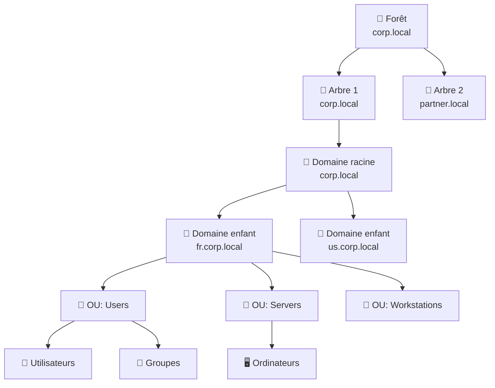
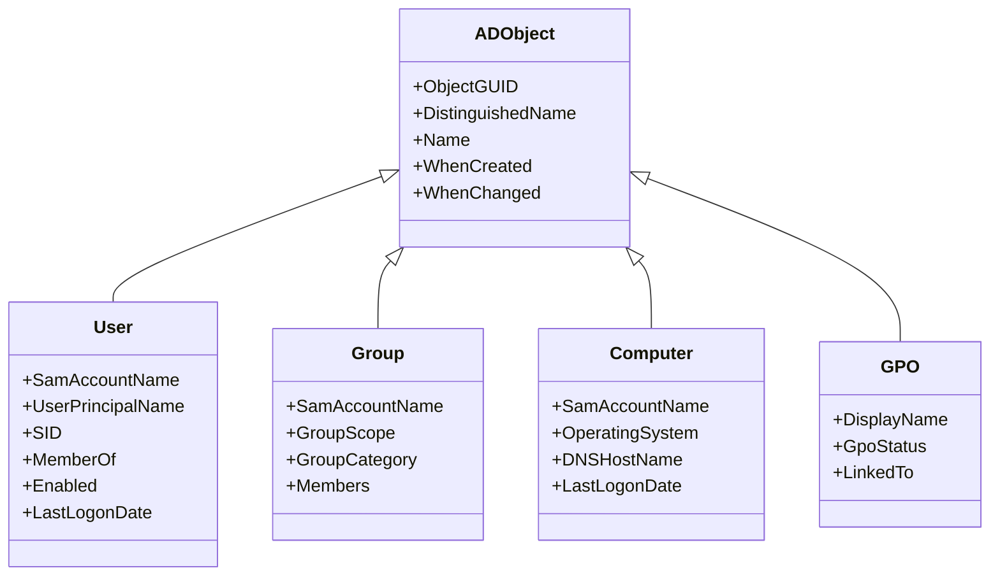
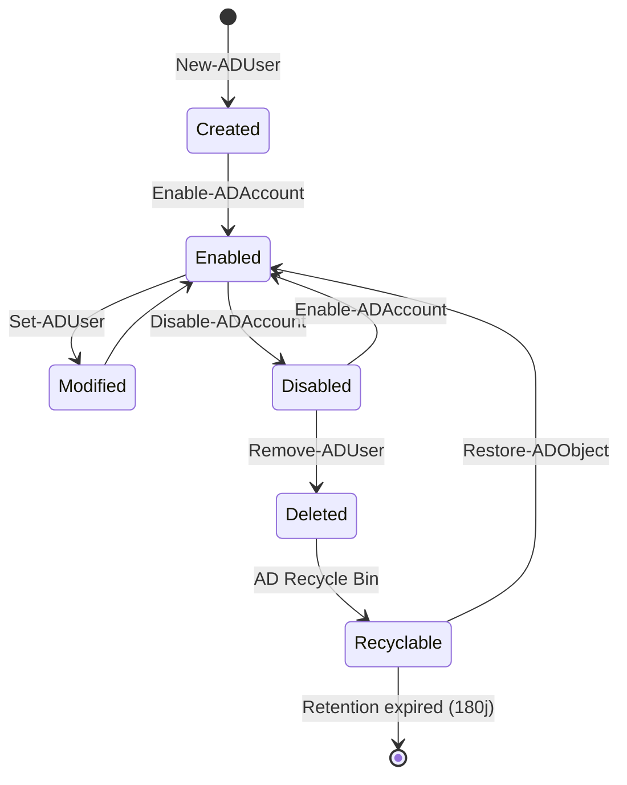
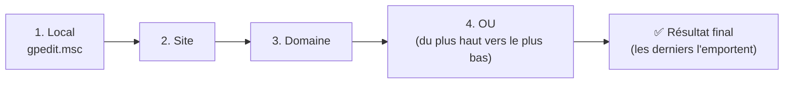
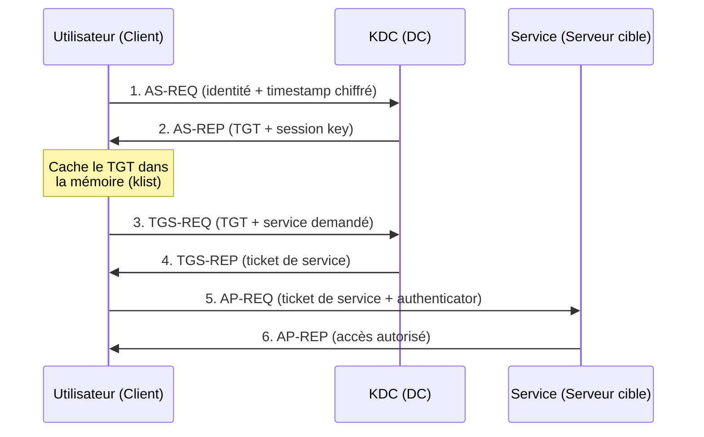
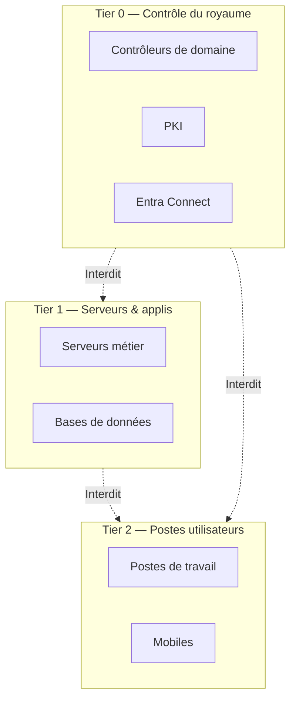
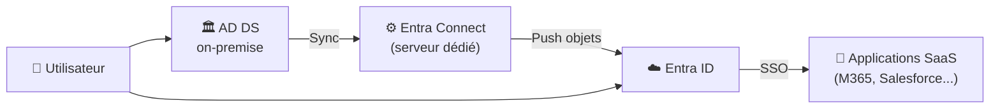

# Fiche 2 — Active Directory : Fondamentaux et Administration

# Fiche 2 — Active Directory : Fondamentaux et Administration

> **Positionnement honnête** : cette fiche est une synthèse pédagogique basée sur la documentation officielle Microsoft Learn. Elle sert de support de révision (SC-300, MD-102, préparation entretiens Support L2 / Ingénieur AD). Les captures d'écran officielles sont référencées via des liens Microsoft Learn.
> 

**Offres ciblées** : Support IT L2 Réseau & IAM · Ingénieur Système AD/Entra ID (Harmonie Mutuelle) · Expert M365/Entra ID/Azure AD

---

## 📋 Sommaire

1. [Contexte & pourquoi Active Directory est encore incontournable](#1--contexte)
2. [Architecture logique d'AD DS](#2--architecture-logique)
3. [Les objets AD et leur cycle de vie](#3--les-objets-ad)
4. [Réplication & rôles FSMO](#4--replication-fsmo)
5. [DNS et Active Directory : couple inséparable](#5--dns-ad)
6. [GPO : Group Policy Objects](#6--gpo)
7. [Kerberos, NTLM et authentification](#7--authentification)
8. [Sécurisation d'AD (tiering, LAPS, Protected Users)](#8--securite)
9. [Hybride : Entra Connect (ex-AD Connect)](#9--hybride)
10. [PowerShell pour AD](#10--powershell-ad)
11. [Troubleshooting courant](#11--troubleshooting)
12. [Questions d'entretien fréquentes](#12--entretien)
13. [Sources officielles](#13--sources)

---

## 1. 🎯 Contexte

Malgré l'essor du cloud, **95 % des grandes entreprises françaises** ont encore un AD on-premise. Les environnements dits *hybrides* (AD + Entra ID synchronisés via Entra Connect) sont **la norme** dans les DSI de grande taille (banques, mutuelles, ministères).

### Compétences visées

- Comprendre l'architecture d'une forêt AD et savoir situer les objets
- Administrer les objets (users, groupes, OU, GPO) via console et PowerShell
- Diagnostiquer des problèmes courants (réplication, résolution DNS, authentification)
- Comprendre les concepts de sécurisation modernes (tiering, LAPS, Protected Users)

---

## 2. 🏗️ Architecture logique

### Hiérarchie AD



### Terminologie clé

| Concept | Définition | Exemple |
| --- | --- | --- |
| **Forêt** (Forest) | Limite de sécurité ultime. Contient un ou plusieurs domaines qui partagent un schéma et un catalogue global. | `corp.local` |
| **Domaine** (Domain) | Limite de réplication. Partition administrative d'AD. | `fr.corp.local` |
| **Arbre** (Tree) | Ensemble de domaines partageant un espace de noms DNS contigu. | `corp.local` → `fr.corp.local` |
| **OU** (Organizational Unit) | Conteneur logique pour organiser objets et appliquer des GPO. **Peut être imbriquée.** | `OU=Paris,OU=FR,DC=corp,DC=local` |
| **Site** | Représentation physique du réseau (basée sur IP). Contrôle la réplication et l'authentification. | `Site-Paris`, `Site-Lyon` |
| **DN** (Distinguished Name) | Chemin unique complet d'un objet. | `CN=Jean Dupont,OU=Paris,DC=corp,DC=local` |
| **SID** | Identifiant unique et immuable d'un objet security principal. | `S-1-5-21-...` |

### Sites et sous-réseaux

Un **site** = zone bien connectée (LAN). Les DCs dans le même site répliquent toutes les 15 secondes ; entre sites différents, la réplication utilise un planning (par défaut 180 min via IP).

**Voir** : [Sites and Services overview](https://learn.microsoft.com/en-us/windows-server/identity/ad-ds/plan/ad-ds-design-considerations-for-active-directory-sites)

---

## 3. 👤 Les objets AD

### Principaux types d'objets



### Portée des groupes (crucial en entretien)

| Portée | Peut contenir | Peut être ajouté à | Cas d'usage |
| --- | --- | --- | --- |
| **Domain Local** | Users, Global, Universal (de toute la forêt) | Domain Local du même domaine | Assigner des permissions sur ressources d'un domaine |
| **Global** | Users, Global (du même domaine) | Global, Domain Local, Universal | Regrouper les utilisateurs par rôle métier |
| **Universal** | Users, Global, Universal (de toute la forêt) | Domain Local, Universal | Cross-domaine (mais coût de réplication) |

**Bonne pratique AGDLP** :

**A**ccounts → **G**lobal groups → **D**omain **L**ocal groups → **P**ermissions

### Cycle de vie d'un objet



**AD Recycle Bin** : activée depuis Windows Server 2008 R2. Rétention par défaut = 180 jours. Permet la restauration complète (attributs, membership).

---

## 4. 🔄 Réplication & FSMO

### Le modèle multi-maître

Tous les DCs sont *équivalents* pour la plupart des opérations. La réplication utilise **USN** (Update Sequence Number) pour propager les changements.

### Les 5 rôles FSMO (Flexible Single Master Operation)

Certaines opérations doivent rester *single-master* pour éviter les conflits.

| Rôle | Portée | Fonction |
| --- | --- | --- |
| **Schema Master** | Forêt | Modifications du schéma |
| **Domain Naming Master** | Forêt | Ajout/suppression de domaines |
| **PDC Emulator** | Domaine | Sync horaire, changements de mot de passe, verrouillages |
| **RID Master** | Domaine | Allocation de pools de RIDs aux DCs |
| **Infrastructure Master** | Domaine | Références inter-domaines |

### Trouver et transférer les FSMO

```powershell
# Identifier les détenteurs de rôles FSMO
netdom query fsmo

# Alternative PowerShell
Get-ADForest | Select-Object SchemaMaster, DomainNamingMaster
Get-ADDomain | Select-Object PDCEmulator, RIDMaster, InfrastructureMaster

# Transférer un rôle (gracieux)
Move-ADDirectoryServerOperationMasterRole -Identity "DC02" -OperationMasterRole PDCEmulator

# Saisir un rôle (force, si DC injoignable — ATTENTION, opération non réversible facilement)
Move-ADDirectoryServerOperationMasterRole -Identity "DC02" -OperationMasterRole PDCEmulator -Force
```

### Diagnostic de réplication

```powershell
# Résumé de l'état de la réplication
repadmin /replsummary

# Détail par partenaire
repadmin /showrepl

# Forcer une réplication
repadmin /syncall /AeD

# Vérifier la santé globale d'un DC
dcdiag /v /c /d

# Vérifier un test spécifique
dcdiag /test:replications
dcdiag /test:dns
```

---

## 5. 🌐 DNS et AD

**Sans DNS fonctionnel, AD ne fonctionne pas.** Les clients localisent les DCs via des enregistrements **SRV**.

### Enregistrements SRV critiques

| Enregistrement | Rôle |
| --- | --- |
| `_ldap._tcp.dc._msdcs.corp.local` | Localiser un DC pour LDAP |
| `_kerberos._tcp.dc._msdcs.corp.local` | Localiser un DC pour Kerberos |
| `_gc._tcp.corp.local` | Localiser un Global Catalog |
| `_ldap._tcp.<site>._sites.dc._msdcs.corp.local` | DC dans un site spécifique |

### Diagnostic DNS

```powershell
# Vérifier la résolution d'un DC
nslookup -type=srv _ldap._tcp.dc._msdcs.corp.local

# Depuis un DC : recréer les enregistrements SRV
ipconfig /registerdns
net stop netlogon && net start netlogon

# Vérifier avec dcdiag
dcdiag /test:dns /v
```

**Bonne pratique** : les DCs doivent pointer vers **eux-mêmes** en DNS primaire, et vers un autre DC en secondaire (pas vers `127.0.0.1` exclusivement — problème connu de `netlogon`).

---

## 6. ⚙️ GPO

### Fonctionnement

Une **GPO** est un ensemble de paramètres appliqués aux utilisateurs et ordinateurs. Elle se lie à un **Site**, **Domaine** ou **OU**.

### Ordre d'application (LSDOU)



### Exceptions

- **Enforced (obligatoire)** : la GPO ne peut être bloquée par un `Block Inheritance`
- **Block Inheritance** : bloque l'héritage sur une OU (sauf `Enforced`)
- **Security Filtering** : cible seulement certains utilisateurs/groupes
- **WMI Filtering** : cible selon des critères WMI (ex: OS version)

### Commandes utiles

```powershell
# Voir les GPO appliquées sur la machine locale
gpresult /r
gpresult /h C:\rapport.html   # rapport HTML détaillé

# Forcer l'application immédiate
gpupdate /force

# Voir tous les GPO du domaine
Get-GPO -All | Format-Table DisplayName, GpoStatus, ModificationTime

# Trouver où une GPO est liée
Get-GPOReport -Name "Politique Password" -ReportType HTML -Path C:\report.html
```

### Configurations GPO courantes en entretien

- **Password Policy** (au niveau du domaine uniquement, dans *Default Domain Policy*)
- **Account Lockout**
- **Software Restriction / AppLocker**
- **Mappage de lecteurs réseau** (Preferences → Drive Maps)
- **Déploiement de certificats**
- **Redirection de dossiers** (Documents, Bureau)

**Voir** : [Group Policy overview](https://learn.microsoft.com/en-us/previous-versions/windows/it-pro/windows-server-2012-r2-and-2012/hh831791(v=ws.11))

---

## 7. 🔐 Authentification

### Kerberos (protocole par défaut depuis Windows 2000)



### Composants clés

- **KDC** (Key Distribution Center) : rôle du DC (AS + TGS)
- **TGT** (Ticket-Granting Ticket) : durée de vie par défaut = 10h
- **Session key** : chiffrement symétrique
- **SPN** (Service Principal Name) : identifie un service (ex: `HTTP/serveur.corp.local`)

### Commandes utiles

```powershell
# Voir les tickets Kerberos en cache
klist

# Purger les tickets
klist purge

# Voir les SPN d'un compte
setspn -L svc_sql

# Ajouter un SPN
setspn -A HTTP/webapp.corp.local svc_web
```

### NTLM (legacy)

Protocole *challenge-response* obsolète mais encore présent (compatibilité). À **désactiver progressivement** — audits d'usage via `Netlogon` logs.

---

## 8. 🛡️ Sécurisation d'AD

### Le modèle de tiering (Microsoft)



**Règle d'or** : **un compte d'admin de Tier N ne doit jamais se connecter à un asset de Tier N+1**. Sinon, compromettre un poste utilisateur = compromettre tout AD.

### LAPS (Local Administrator Password Solution)

Gère automatiquement le mot de passe de l'admin local de chaque poste :

- Mot de passe unique par machine
- Rotation automatique (30 jours par défaut)
- Stockage chiffré dans AD
- Depuis Windows 11 22H2 → **Windows LAPS** intégré nativement

**Voir** : [Windows LAPS overview](https://learn.microsoft.com/en-us/windows-server/identity/laps/laps-overview)

### Protected Users (groupe spécial)

Membres du groupe **Protected Users** :

- Kerberos AES uniquement (pas de RC4)
- Pas de délégation NTLM
- TGT de 4h non renouvelable
- Pas de mise en cache des identifiants

👉 À utiliser pour les comptes admin Tier 0.

### Autres pratiques essentielles

- **Désactiver SMBv1**
- **Auditer les groupes privilégiés** (Domain Admins, Enterprise Admins) — < 5 comptes idéalement
- **Comptes de service dédiés** (gMSA — Group Managed Service Accounts) au lieu de comptes utilisateurs
- **Journalisation** : Event ID 4624 (logon success), 4625 (fail), 4740 (lockout), 4776 (NTLM)
- **Audit avec BloodHound** (outil de red team) pour détecter les chemins d'attaque

---

## 9. ☁️ Hybride : Entra Connect

### Rôle

**Entra Connect** (anciennement **Azure AD Connect**) synchronise les objets AD on-premise vers Entra ID.



### Méthodes d'authentification hybride

| Méthode | Où le mot de passe est vérifié | Cas d'usage |
| --- | --- | --- |
| **Password Hash Sync (PHS)** | Cloud (hash du hash) | Simplicité maximale. Recommandé par défaut. |
| **Pass-Through Auth (PTA)** | On-premise (via agents) | Politique de mot de passe strictement on-prem |
| **Federation (ADFS)** | ADFS on-premise | Legacy, SSO complexe, cartes à puce |

### Attributs synchronisés

Par défaut : ~150 attributs (nom, email, group membership, manager…). Personnalisable via **Synchronization Rules Editor**.

**Attribut d'ancrage** : `objectGUID` (immuable) → `ImmutableId` côté Entra ID.

### Commandes utiles

```powershell
# Sur le serveur Entra Connect
Import-Module ADSync

# Voir la config du connecteur
Get-ADSyncConnector

# Forcer une sync delta (défaut = toutes les 30 min)
Start-ADSyncSyncCycle -PolicyType Delta

# Forcer une sync complète
Start-ADSyncSyncCycle -PolicyType Initial

# Voir l'état du scheduler
Get-ADSyncScheduler
```

**Voir** : [Entra Connect Sync topology](https://learn.microsoft.com/en-us/entra/identity/hybrid/connect/plan-connect-topologies)

---

## 10. 💻 PowerShell AD

### Module requis

```powershell
# Sur un poste admin (RSAT installé) ou un DC
Import-Module ActiveDirectory
```

### Cheat sheet

```powershell
# --- USERS ---
New-ADUser -Name "Jean Dupont" -SamAccountName jdupont `
  -UserPrincipalName jdupont@corp.local `
  -Path "OU=Paris,DC=corp,DC=local" `
  -AccountPassword (ConvertTo-SecureString "MotDePasse!" -AsPlainText -Force) `
  -Enabled $true

Get-ADUser jdupont -Properties *
Set-ADUser jdupont -Department "IT" -Title "Administrateur système"
Disable-ADAccount jdupont
Enable-ADAccount jdupont
Unlock-ADAccount jdupont
Remove-ADUser jdupont

# Trouver les utilisateurs inactifs (> 90 jours)
Search-ADAccount -AccountInactive -TimeSpan 90 -UsersOnly | 
  Select-Object Name, LastLogonDate

# --- GROUPES ---
New-ADGroup -Name "GG_IT_Support" -GroupScope Global -GroupCategory Security -Path "OU=Groups,DC=corp,DC=local"
Add-ADGroupMember -Identity "GG_IT_Support" -Members jdupont, msmith
Get-ADGroupMember "GG_IT_Support" -Recursive
Remove-ADGroupMember -Identity "GG_IT_Support" -Members jdupont -Confirm:$false

# --- OU ---
New-ADOrganizationalUnit -Name "Paris" -Path "DC=corp,DC=local" -ProtectedFromAccidentalDeletion $true

# --- ORDINATEURS ---
Get-ADComputer -Filter * -Properties OperatingSystem | 
  Group-Object OperatingSystem | 
  Select-Object Name, Count

# --- REQUÊTES AVANCÉES ---
# Users membres d'un groupe spécifique
Get-ADGroupMember "Domain Admins" | Get-ADUser -Properties LastLogonDate

# Users dont le mot de passe n'expire jamais (à auditer !)
Get-ADUser -Filter { PasswordNeverExpires -eq $true -and Enabled -eq $true } | 
  Select-Object Name, SamAccountName

# Users créés dans les 7 derniers jours
Get-ADUser -Filter { whenCreated -ge (Get-Date).AddDays(-7) }
```

---

## 11. 🔧 Troubleshooting courant

### Symptôme → Diagnostic

| Symptôme | Commande de diagnostic | Cause probable |
| --- | --- | --- |
| Compte utilisateur verrouillé en boucle | `Get-ADUser <sam> -Properties LockedOut, badPwdCount`  • logs 4740 sur le PDC | Session Windows/mobile avec ancien mdp, service qui utilise anciens creds |
| Impossible d'ouvrir de session sur poste | `nltest /sc_verify:corp.local` sur le poste | Trust broken → `Reset-ComputerMachinePassword` |
| Réplication en erreur | `repadmin /replsummary`  • `dcdiag /test:replications` | DNS, firewall, temps désynchronisé, USN rollback |
| GPO non appliquée | `gpresult /r` puis `gpresult /h rapport.html` | Filtrage sécurité, block inheritance, WMI filter |
| Ordinateur perd la relation d'approbation | Event 5719 sur le poste | Secure Channel cassé → réintégrer au domaine |
| Sync Entra Connect échoue | Sync Service Manager + `Get-ADSyncConnectorRunStatus` | Objet corrompu, doublon UPN/proxyAddress |

### Outils essentiels

- **`dcdiag`** : santé globale d'un DC
- **`repadmin`** : réplication
- **`nslookup`** : DNS
- **`nltest`** : trust, secure channel
- **`netdom`** : opérations de domaine
- **`gpresult`** / **`rsop.msc`** : diagnostic GPO
- **Event Viewer** : `System`, `Directory Service`, `DNS Server`, `Security`
- **PowerShell** : `Get-Winevent`, `Test-ComputerSecureChannel`

---

## 12. 💼 Questions d'entretien fréquentes

1. **« Décrivez ce qu'est un contrôleur de domaine (DC). »**
    
    → Serveur Windows Server ayant AD DS installé et promu. Héberge une réplique de la base AD (`ntds.dit`) et fournit LDAP, Kerberos, DNS.
    
2. **« Quelle est la différence entre un groupe Global et un groupe Universal ? »**
    
    → Voir tableau section 3. Point clé : les groupes Universal sont **répliqués dans le Global Catalog**, donc chaque changement d'appartenance a un coût de réplication inter-domaines.
    
3. **« Comment restaurer un utilisateur supprimé accidentellement ? »**
    
    → Si la corbeille AD est activée : `Get-ADObject -Filter {SamAccountName -eq "jdupont"} -IncludeDeletedObjects | Restore-ADObject`. Sinon : restauration authoritative via Windows Server Backup.
    
4. **« Un poste ne peut plus se connecter au domaine, secure channel cassé. Que faites-vous ? »**
    
    → 1) `Test-ComputerSecureChannel` pour confirmer. 2) `Reset-ComputerMachinePassword` sans quitter le domaine. 3) En dernier recours : sortir/réintégrer du domaine.
    
5. **« Expliquez le principe AGDLP. »**
    
    → **A**ccounts (users) → **G**lobal groups (par rôle métier) → **D**omain **L**ocal groups (par permission ressource) → **P**ermissions (ACL sur la ressource). Permet la séparation des concernes et facilite la maintenance.
    
6. **« PDC Emulator, à quoi ça sert au quotidien ? »**
    
    → Source de temps du domaine, applique les changements de mot de passe en priorité, gère les verrouillages de compte, prend en charge les clients pré-Win2000.
    
7. **« Un utilisateur clignote entre verrouillé et déverrouillé. Où chercher ? »**
    
    → Sur le **PDC Emulator** dans le Security log, Event ID **4740**. La colonne *Caller Computer Name* indique la source.
    

---

## 13. 📚 Sources officielles

### Documentation Microsoft Learn (vérifiées)

- [Active Directory Domain Services Overview](https://learn.microsoft.com/en-us/windows-server/identity/ad-ds/get-started/virtual-dc/active-directory-domain-services-overview)
- [AD DS design considerations](https://learn.microsoft.com/en-us/windows-server/identity/ad-ds/plan/ad-ds-design-considerations-for-active-directory-sites)
- [FSMO roles reference](https://learn.microsoft.com/en-us/troubleshoot/windows-server/active-directory/fsmo-roles)
- [Group Policy overview](https://learn.microsoft.com/en-us/previous-versions/windows/it-pro/windows-server-2012-r2-and-2012/hh831791(v=ws.11))
- [Windows LAPS overview](https://learn.microsoft.com/en-us/windows-server/identity/laps/laps-overview)
- [Entra Connect Sync topology](https://learn.microsoft.com/en-us/entra/identity/hybrid/connect/plan-connect-topologies)
- [Active Directory PowerShell module](https://learn.microsoft.com/en-us/powershell/module/activedirectory/)
- [Securing privileged access](https://learn.microsoft.com/en-us/security/privileged-access-workstations/overview)

### Certifications alignées

- **AZ-800** : Administering Windows Server Hybrid Core Infrastructure
- **AZ-801** : Configuring Windows Server Hybrid Advanced Services
- **SC-300** : Microsoft Identity and Access Administrator

---

*Fiche rédigée dans le cadre de ma préparation aux entretiens Support L2 / Ingénieur Système AD. Toutes les informations proviennent de la documentation Microsoft officielle et de la pratique de terrain (7+ années).*

**Version** : 1.0 · **Dernière mise à jour** : Août 2026 · **Auteur** : Daniel ASSOU ZIKPO