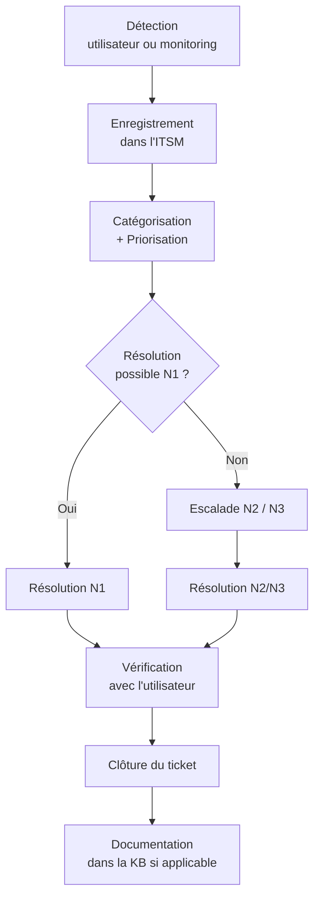
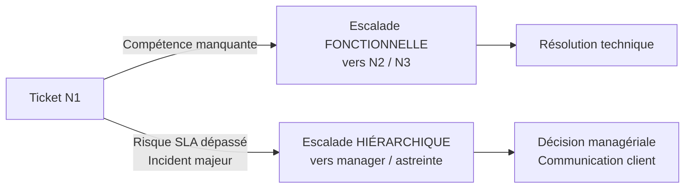

# Fiche 5 — ITIL 4 & Workflow du Support IT

# Fiche 5 — ITIL 4 & Workflow du Support IT

<aside>
🎯

**Pourquoi cette fiche ?**

ITIL 4 est le référentiel de gestion des services IT le plus adopté au monde. Toutes les offres de Spécialiste Support IT L2 le mentionnent. Cette fiche synthétise ce qu'un support L2 doit maîtriser pour être opérationnel dès le premier jour.

</aside>

**Ce que vous saurez faire après cette fiche :**

- Comprendre le vocabulaire commun aux équipes IT (incident, problème, demande, changement)
- Prioriser correctement les tickets (matrice Impact × Urgence)
- Respecter les SLA contractuels
- Escalader au bon moment, au bon niveau
- Communiquer proprement avec l'utilisateur

---

## 📚 1. Contexte ITIL 4 (2019)

ITIL 4 remplace ITIL v3 (2011). Les changements majeurs :

| ITIL v3 | ITIL 4 |
| --- | --- |
| 26 processus | 34 pratiques |
| Cycle de vie linéaire | Système de valeur des services (SVS) |
| Approche processus | Approche holistique (4 dimensions) |
| Gouvernance implicite | Gouvernance explicite au cœur |

### Les 4 dimensions ITIL 4

1. **Organisations et personnes** — cultures, rôles, compétences
2. **Information et technologie** — outils, systèmes, données
3. **Partenaires et fournisseurs** — contrats, tiers
4. **Flux de valeur et processus** — comment on livre la valeur

<aside>
🎓

**Certification recommandée :** ITIL 4 Foundation via PeopleCert (~350 €, 60 questions, 40 min, 65 % pour réussir). Excellent atout CV pour un support L2.

</aside>

---

## 🎫 2. Les 3 types d'enregistrements — à ne jamais confondre

### 2.1 Incident

**Définition :** interruption non planifiée d'un service, ou réduction de sa qualité.

**Exemples :**

- L'utilisateur ne peut plus se connecter à Outlook
- Le VPN ne fonctionne plus
- L'imprimante du 3ᵉ étage ne répond plus

**Objectif :** rétablir le service **le plus vite possible**, même par contournement.

### 2.2 Demande de service (Service Request)

**Définition :** demande formelle d'un utilisateur pour obtenir quelque chose de standard et pré-approuvé.

**Exemples :**

- Nouvel accès à un dossier partagé
- Réinitialisation d'un mot de passe
- Installation d'un logiciel du catalogue
- Demande de matériel supplémentaire

**Objectif :** livrer selon un catalogue de services défini.

### 2.3 Problème

**Définition :** cause racine d'un ou plusieurs incidents.

**Exemples :**

- Un patch Windows défectueux provoque des BSOD sur 30 postes → 30 incidents = **1 problème**
- Une fuite mémoire sur un serveur applicatif qui plante toutes les 48 h

**Objectif :** identifier et éliminer la cause racine pour empêcher la récurrence.

<aside>
💡

**Analogie médicale :**

- **Incident** = "Le patient a de la fièvre → paracétamol pour faire baisser la fièvre"
- **Problème** = "Pourquoi le patient a-t-il de la fièvre ? → diagnostic → traiter la cause"
</aside>

---

## ⚙️ 3. Cycle de vie d'un incident



**Points clés :**

- La **catégorisation** conditionne le routage automatique et les rapports
- La **priorisation** conditionne le SLA
- La **clôture** ne se fait qu'après validation utilisateur (jamais unilatéralement)

---

## 📊 4. Matrice de priorité (Impact × Urgence)

- **Impact** = combien d'utilisateurs / services touchés
- **Urgence** = à quel point c'est bloquant pour l'activité

| Impact ↓ / Urgence → | Haute | Moyenne | Basse |
| --- | --- | --- | --- |
| **Élevé** (>50 users) | 🔴 P1 – Critique | 🟠 P2 – Haute | 🟡 P3 – Moyenne |
| **Moyen** (10–50 users) | 🟠 P2 – Haute | 🟡 P3 – Moyenne | 🟢 P4 – Basse |
| **Faible** (<10 users) | 🟡 P3 – Moyenne | 🟢 P4 – Basse | ⚪ P5 – Planifiée |

**Exemples d'application :**

- Serveur Exchange down = Impact Élevé × Urgence Haute → **P1**
- Un utilisateur ne peut pas imprimer = Impact Faible × Urgence Moyenne → **P4**
- 15 comptables ne peuvent pas ouvrir le logiciel paie le 30 du mois = Impact Moyen × Urgence Haute → **P2**

---

## ⏱️ 5. SLA, OLA, UC — les 3 contrats à connaître

| Acronyme | Nom complet | Entre qui ? | Exemple |
| --- | --- | --- | --- |
| **SLA** | Service Level Agreement | IT ↔ Client / Métier | "Résolution P1 sous 4 h" |
| **OLA** | Operational Level Agreement | Équipes IT internes | "N1 escalade vers N2 sous 30 min" |
| **UC** | Underpinning Contract | IT ↔ Fournisseur externe | "Fournisseur telecom réponse 2 h" |

### Exemples chiffrés typiques

| Priorité | Accusé de réception | Résolution |
| --- | --- | --- |
| P1 | 15 min | 4 h |
| P2 | 30 min | 8 h |
| P3 | 2 h | 24 h |
| P4 | 4 h | 3 jours ouvrés |
| P5 | 1 jour | 10 jours ouvrés |

<aside>
⚠️

Ces chiffres sont indicatifs. Chaque entreprise définit ses propres SLA. **Toujours consulter le contrat de service** avant de s'engager auprès d'un utilisateur.

</aside>

---

## 🔺 6. Escalade — fonctionnelle vs hiérarchique



### Escalade fonctionnelle (technique)

- Ticket passé à un niveau supérieur (N1 → N2 → N3)
- **Motif** : compétence technique nécessaire
- **Exemple** : "Utilisateur bloqué en boucle MFA sur Conditional Access → escalade N2 IAM"

### Escalade hiérarchique (managériale)

- Ticket signalé à un manager / responsable / astreinte
- **Motif** : risque de dépassement de SLA, escalade client, incident majeur
- **Exemple** : "P1 en cours depuis 3 h, on va rater le SLA de 4 h → signalement au chef d'astreinte"

<aside>
📝

**Règle d'or :** on documente **toujours** dans le ticket : pourquoi on escalade, à qui, à quelle heure, avec un résumé des actions déjà tentées. Ça évite au N2 de repartir de zéro et ça protège le N1 en cas de litige.

</aside>

---

## 📖 7. Base de connaissances (KB) — bonnes pratiques

Une KB bien tenue peut **diviser par 3 le MTTR** et augmenter le **FCR de 20-30 %**. Structure d'un article efficace :

```markdown
# [Titre : symptôme observé, pas cause supposée]

## Symptôme
Ce que voit l'utilisateur (message d'erreur exact, capture d'écran)

## Cause probable
Explication technique brève

## Résolution
1. Étape 1 (commande exacte si applicable)
2. Étape 2
3. Étape 3

## Vérification
Comment confirmer que c'est résolu

## Tags
mots-clés pour la recherche interne

## Applicable à
Windows 10 / Windows 11 / Server 2019 / etc.

## Dernière vérification
Date + auteur
```

**Anti-pattern à éviter :** titre du type "Problème Outlook". Préférer : "Outlook affiche 'Impossible de démarrer Microsoft Outlook' au lancement".

---

## 📈 8. Métriques clés

| Métrique | Définition | Cible saine |
| --- | --- | --- |
| **MTTR** (Mean Time To Resolve) | Temps moyen de résolution | ⬇️ à minimiser |
| **MTBF** (Mean Time Between Failures) | Temps moyen entre pannes | ⬆️ à maximiser |
| **FCR** (First Contact Resolution) | % tickets résolus au premier contact | > 70 % |
| **Taux de respect SLA** | % tickets clos dans les délais | > 95 % |
| **Backlog** | Tickets ouverts non traités | Stable ou en baisse |
| **CSAT** (Customer Satisfaction) | Note utilisateur post-résolution | > 4 / 5 |
| **Réouverture** | % tickets rouverts après clôture | < 5 % |

---

## 🛠️ 9. Outils ITSM du marché

| Outil | Segment | Points forts |
| --- | --- | --- |
| **ServiceNow** | Grand compte / Enterprise | Leader mondial, très complet, coûteux |
| **Jira Service Management** | Éditeurs logiciels, DevOps | Intégration Jira, workflows flexibles |
| **GLPI** | PME / secteur public FR | Open source, gratuit, inventaire natif |
| **Freshservice** | PME / ETI | Cloud, UX moderne, bon rapport qualité/prix |
| **BMC Helix** | Grand compte | Historique riche, IA avancée |
| **EasyVista** | France, ETI | Éditeur français, no-code |

<aside>
🎯

**Correspondance avec les offres visées :**

- Offre 1 (Ministère CI) → probablement **GLPI** ou **EasyVista** (secteur public)
- Offre 2 (Finance de marché) → très souvent **ServiceNow**
- Offres 4-5 (Harmonie Mutuelle) → **ServiceNow** ou **BMC Helix**

Mentionner GLPI et ServiceNow en entretien couvre 80 % des cas.

</aside>

---

## 💬 10. Communication utilisateur — les 5 clés

1. **Accuser réception dans le délai du SLA**, même si la résolution est longue à venir
2. **Vulgariser** : jamais de jargon technique dans les messages ouverts à l'utilisateur
3. **Donner un ETA réaliste** : mieux vaut annoncer 2 h et livrer en 1 h 30 que l'inverse
4. **Tenir informé** : un message toutes les 30-60 min si la résolution traîne
5. **Fermer proprement** : confirmer la résolution + demander feedback

### Exemple de message d'accusé de réception

<aside>
📧

Bonjour Madame Dupont,

J'ai bien reçu votre ticket concernant l'impossibilité d'accéder à votre boîte Outlook (ticket #INC0012345). Je le prends en charge dès maintenant.

Compte tenu de la priorité affectée, je vous recontacte au plus tard sous **2 heures** avec un premier diagnostic ou une résolution.

Bien cordialement,

Johannes — Support IT L2

</aside>

---

## 🎯 11. Questions d'entretien fréquentes

- **Q1 — Quelle est la différence entre un incident et une demande de service ?**
    
    Un **incident** est une interruption non planifiée d'un service : le service ne marche plus ou marche mal. Une **demande de service** est une demande de quelque chose de standard et pré-approuvé : nouvel accès, installation logiciel du catalogue, matériel supplémentaire.
    
    L'objectif d'un incident est de rétablir le service au plus vite ; celui d'une demande est de la livrer selon les délais du catalogue.
    
- **Q2 — Comment prioriseriez-vous un ticket ?**
    
    Je combine deux dimensions : l'**impact** (combien d'utilisateurs ou de services sont touchés) et l'**urgence** (à quel point c'est bloquant pour l'activité). Je croise les deux dans une matrice qui me donne une priorité de P1 (critique) à P5 (planifiée). Je vérifie aussi la matrice de priorité définie par l'entreprise, qui peut avoir ses propres règles métier.
    
- **Q3 — Un utilisateur est bloqué depuis 2 h et le SLA P2 expire dans 30 min. Que faites-vous ?**
    
    Je fais deux choses **en parallèle** :
    
    1. **Escalade fonctionnelle** : je passe le ticket au N2 avec un résumé de ce qui a été tenté, pour ne pas repartir de zéro.
    2. **Escalade hiérarchique** : je signale à mon responsable ou à l'astreinte que le SLA est à risque, pour qu'il puisse anticiper la communication avec le métier ou débloquer une ressource.
    
    Je tiens aussi l'utilisateur informé du statut, sans faire de promesse que je ne pourrais pas tenir.
    
- **Q4 — Qu'est-ce qu'un problème en ITIL ?**
    
    Un **problème** est la cause racine d'un ou plusieurs incidents. Alors qu'un incident vise à rétablir le service (parfois par contournement), un problème vise à identifier et éliminer la cause pour empêcher la récurrence.
    
    **Exemple :** 30 utilisateurs signalent des BSOD après un patch Windows → 30 incidents mais **1 problème** (le patch défectueux).
    
- **Q5 — Que signifient MTTR et FCR, et pourquoi c'est important ?**
    
    **MTTR** (Mean Time To Resolve) est le temps moyen de résolution des tickets. **FCR** (First Contact Resolution) est le pourcentage de tickets résolus dès le premier contact avec l'utilisateur.
    
    Ce sont deux indicateurs clés de la qualité du support : un MTTR bas et un FCR élevé indiquent une équipe efficace, avec une base de connaissances riche et des collaborateurs bien formés.
    
- **Q6 — Comment gérez-vous un utilisateur agressif au téléphone ?**
    
    Je garde le calme et je ne prends pas les propos personnellement. J'écoute jusqu'au bout sans interrompre pour laisser la personne exprimer sa frustration. Je reformule le problème pour montrer que j'ai compris ("Si je résume, votre problème est X, et ça vous bloque pour Y"). Puis je passe à l'action concrète : soit je résous, soit j'annonce un délai clair et je m'y tiens.
    
    Si le comportement dépasse le cadre acceptable, je préviens poliment que je vais devoir passer le relais à mon responsable, et j'escalade.
    

---

## 📚 Sources officielles

- ITIL 4 Foundation — PeopleCert : [https://www.peoplecert.org](https://www.peoplecert.org)
- Vue d'ensemble ITIL — AXELOS : [https://www.axelos.com](https://www.axelos.com)
- Documentation ServiceNow ITSM : [https://www.servicenow.com/products/itsm.html](https://www.servicenow.com/products/itsm.html)
- Jira Service Management : [https://www.atlassian.com/software/jira/service-management](https://www.atlassian.com/software/jira/service-management)
- GLPI (open source) : [https://glpi-project.org](https://glpi-project.org)

---

<aside>
➡️

**Prochaine fiche :** Fiche 6 — Linux Essentials pour le support de production (à créer avec Google Cloud Shell + captures réelles).

</aside>