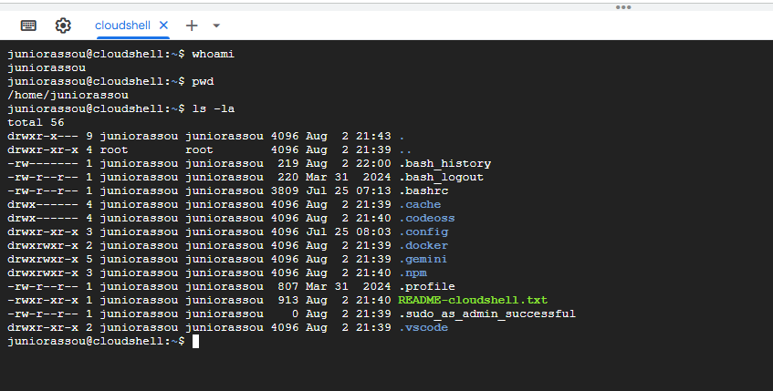
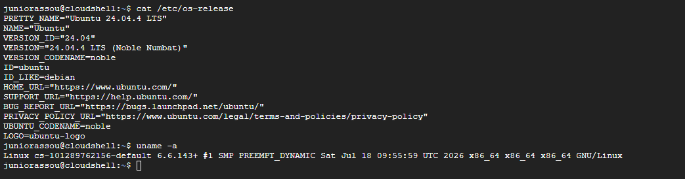
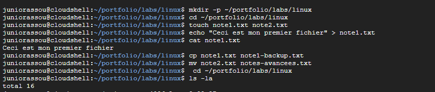
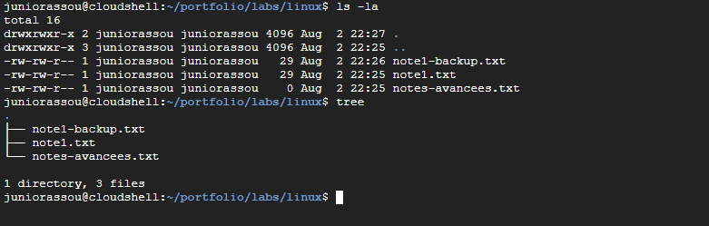
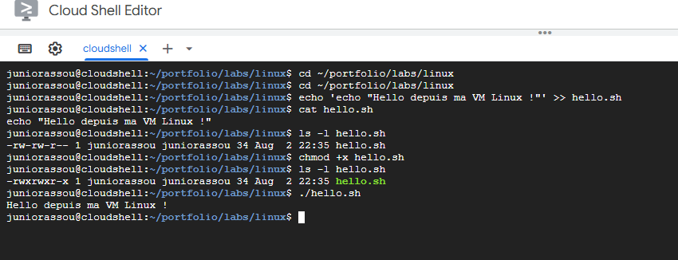
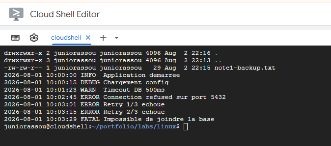
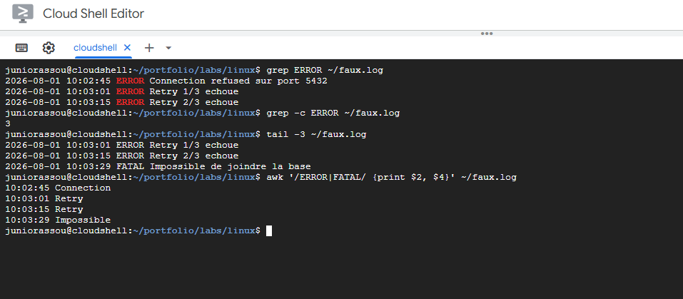
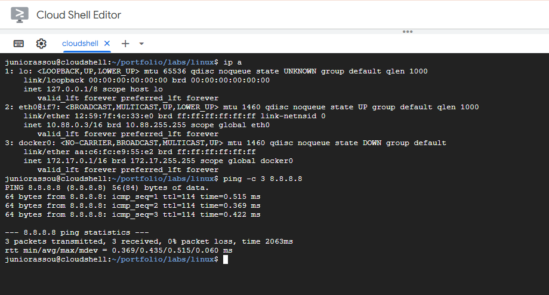
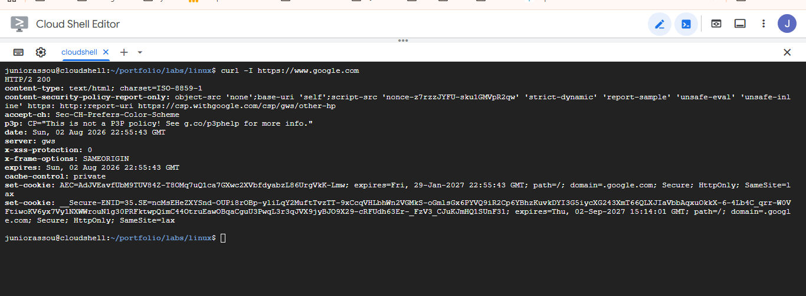
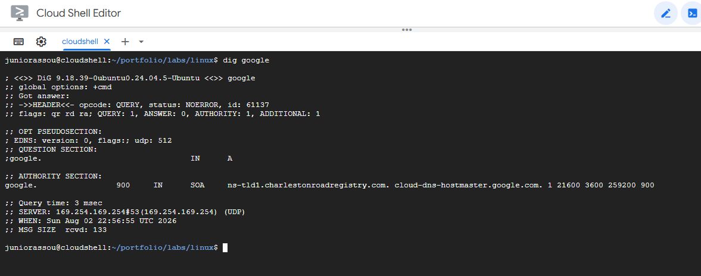

# Lab 2 — Linux Essentials en pratique (Google Cloud Shell)

# Lab 2 — Linux Essentials en pratique

<aside>
🎯

**Objectif du lab :** maîtriser les commandes Linux fondamentales indispensables au support production L2. Réalisé dans un environnement Linux réel (Ubuntu 24.04 LTS sur Google Cloud Shell), avec captures d'écran authentiques de chaque étape.

</aside>

**Auteur :** ASSOU ZIKPO DANIEL · **Date :** Août 2026 · **Durée :** ~2h

**Contexte :** Préparation pour postes Support Applicatif Finance de Marché et Ingénieur Support Production

**Fiche technique associée :** [Fiche 6 — Linux Essentials pour le Support Production](https://app.notion.com/p/Fiche-6-Linux-Essentials-pour-le-Support-Production-09ae865fe6624a66b15e8a6a71bed821?pvs=21)

---

## 📚 1. Environnement utilisé

| Élément | Détail |
| --- | --- |
| Plateforme | Google Cloud Shell (`shell.cloud.google.com`) |
| Distribution | Ubuntu 24.04 LTS "Noble Numbat" (basée sur Debian) |
| Type d'accès | VM Linux gratuite, dans le navigateur, avec 5 Go persistants |
| Pré-requis pour reproduire | Un compte Google (Gmail) uniquement |
| Coût | 0 € (aucune carte bancaire requise) |

<aside>
💡

**Pourquoi Cloud Shell ?** Aucune installation locale requise, environnement Linux 100 % réel (pas une simulation), reproductible partout, sans risque pour la machine hôte. Idéal pour un lab de portfolio.

</aside>

---

## 🎯 2. Compétences travaillées

- ✅ Navigation dans un système de fichiers Linux (FHS)
- ✅ Création, copie, déplacement et suppression de fichiers/dossiers
- ✅ Gestion des permissions Unix (`chmod`, modèle rwx)
- ✅ Exécution de scripts shell
- ✅ Recherche dans les logs (`grep`, `tail`, `awk`)
- ✅ Diagnostic réseau (`ip`, `ping`, `curl`, `dig`)
- ✅ Installation de paquets (`apt`)

---

## 🕬️ Exercice 1 — Découverte de l'environnement

**Objectif :** confirmer l'identité de la VM, sa distribution, ses ressources.

### 🔹 1.1 Identité et environnement

```bash
whoami       # Nom de l'utilisateur connecté
pwd          # Dossier de travail actuel
ls -la       # Contenu du home (fichiers cachés inclus)
```



01a-identite.png — Terminal Cloud Shell : whoami, pwd, ls -la

**Analyse :** `whoami` retourne le nom d'utilisateur, `pwd` confirme qu'on est dans `/home/<user>`, `ls -la` montre les fichiers de configuration cachés (`.bashrc`, `.profile`…) typiques d'un compte Linux.

### 🔹 1.2 Distribution et noyau

```bash
cat /etc/os-release      # Distribution + version
uname -a                  # Version du noyau Linux
```



01b-systeme.png — Distribution Ubuntu 24.04 LTS + noyau Linux

**Analyse :** Cloud Shell tourne sous **Debian GNU/Linux**. `uname -a` donne la version précise du noyau, l'architecture CPU (x86_64), la date de compilation.

### 🔹 1.3 Ressources système

```bash
free -h      # Mémoire disponible (RAM + swap)
df -h        # Espace disque libre par partition
nproc        # Nombre de CPU logiques
```


01c-ressources.png — Mémoire, disque et CPU disponibles

**Analyse :** Ces 3 commandes sont le **premier réflexe** quand on découvre une nouvelle machine ou qu'on diagnostique un ralentissement. En support prod, `df -h` est souvent la commande n° 1 quand un serveur ne répond plus (partition pleine).

---

## 📂 Exercice 2 — Manipulation de fichiers

**Objectif :** créer, écrire, copier, renommer, organiser une arborescence.

### 🔹 2.1 Créer et manipuler les fichiers

```bash
mkdir -p ~/portfolio/labs/linux    # Crée l'arborescence en une commande
cd ~/portfolio/labs/linux
touch note1.txt note2.txt          # Crée 2 fichiers vides d'un coup
echo "Ceci est mon premier fichier" > note1.txt    # Écrit du texte
cat note1.txt                       # Affiche le contenu
cp note1.txt note1-backup.txt      # Copie
mv note2.txt notes-avancees.txt    # Renomme
```



02a-creation-fichiers.png — mkdir, touch, echo, cp, mv en action

**Analyse :** L'option `-p` de `mkdir` crée les dossiers intermédiaires en une seule commande, contrairement à Windows où il faudrait créer niveau par niveau. La redirection `>` écrit dans un fichier (écrase s'il existe), `>>` ajoute à la fin.

### 🔹 2.2 Vérifier l'arborescence

```bash
sudo apt install tree -y    # Installation préalable (tree n'est pas natif)
cd ~/portfolio/labs/linux
ls -la                       # Vue détaillée
tree                         # Vue arborescente
```



02b-arborescence.png — Sortie de ls -la et tree du dossier lab

**Analyse :** `tree` offre une vue visuelle immédiate de la structure d'un projet, très utile pour documenter une intervention. `ls -la` reste l'outil canonique quand `tree` n'est pas installé (souvent le cas sur des serveurs de production stricts).

---

## 🔐 Exercice 3 — Permissions & exécution

**Objectif :** créer un script shell, le rendre exécutable, le lancer.

```bash
cd ~/portfolio/labs/linux
echo '#!/bin/bash' > hello.sh                       # Shebang
echo 'echo "Hello depuis ma VM Linux !"' >> hello.sh
cat hello.sh              # Vérifie le contenu
ls -l hello.sh            # Permissions initiales
chmod +x hello.sh         # Rend exécutable
ls -l hello.sh            # Permissions après chmod
./hello.sh                # Exécute le script
```



03-permissions-execution.png — chmod +x transforme rw-rw-r-- en rwxrwxr-x et lance hello.sh

### 💡 Point-clé : le modèle de permissions Unix

| Étape | Sortie `ls -l` | Signification |
| --- | --- | --- |
| Avant `chmod` | `-rw-r--r--` | Lecture pour tous, écriture pour propriétaire, **PAS exécutable** |
| Après `chmod +x` | `-rwxr-xr-x` | Lecture + exécution pour tous, écriture pour propriétaire |

**Analyse :** Contrairement à Windows où l'extension `.exe`/`.bat` définit l'exécutabilité, Linux exige un **bit d'exécution explicite**. C'est pour ça qu'un script fraîchement copié depuis Windows refuse de s'exécuter tant qu'on n'a pas fait `chmod +x`. Cas réel support : un dev me dit "mon script d'automatisation ne se lance pas en prod" → réflexe `ls -l script.sh`.

---

## 🔍 Exercice 4 — Recherche dans les logs (compétence L2 clé)

**Objectif :** simuler un fichier de logs applicatif, y chercher les erreurs, extraire des informations ciblées.

### 🔹 4.1 Générer un log applicatif réaliste

```bash
cat > ~/faux.log <<'EOF'
2026-08-01 10:00:00 INFO  Application demarree
2026-08-01 10:00:15 DEBUG Chargement config
2026-08-01 10:01:23 WARN  Timeout DB 500ms
2026-08-01 10:02:45 ERROR Connection refused sur port 5432
2026-08-01 10:03:01 ERROR Retry 1/3 echoue
2026-08-01 10:03:15 ERROR Retry 2/3 echoue
2026-08-01 10:03:29 FATAL Impossible de joindre la base
EOF
cat ~/faux.log       # Affiche l'intégralité du log
```



04a-log-genere.png — Log applicatif complet avec INFO/DEBUG/WARN/ERROR/FATAL

**Analyse :** Le `heredoc` (`<<EOF ... EOF`) permet d'écrire un fichier multi-lignes d'un coup, technique très utile pour générer des fichiers de configuration en scripts d'installation.

### 🔹 4.2 Analyser le log (grep, tail, awk)

```bash
grep ERROR ~/faux.log             # Lignes contenant "ERROR"
grep -c ERROR ~/faux.log          # Nombre d'occurrences
tail -3 ~/faux.log                # 3 dernières lignes
awk '/ERROR|FATAL/ {print $2, $4}' ~/faux.log   # Heure + type d'erreur
```



04b-analyse-log.png — grep, tail, awk pour extraire les erreurs

### 💡 Point-clé : la chaîne de diagnostic support L2

| Question support | Commande réflexe | Info obtenue |
| --- | --- | --- |
| "Où sont les erreurs ?" | `grep -i "error" fichier.log` | Toutes les lignes d'erreur |
| "Est-ce massif ou ponctuel ?" | `grep -c "error" fichier.log` | Nombre d'occurrences |
| "Quel est le dernier état avant le crash ?" | `tail -20 fichier.log` | Contexte de la panne |
| "Extraire une info ciblée" | `awk '/motif/ {print $col}' fichier.log` | Colonnes sélectionnées |

**Analyse :** `grep` est **la** commande la plus utilisée par un support production Linux. Un support L2 efficace localise l'erreur dans un fichier de 10 000 lignes en moins de 30 secondes grâce à cette chaîne.

⚠️ **Point d'attention :** `grep ERROR` est **sensible à la casse**. Pour capturer aussi les "error", "Error", "ERROR", il faut utiliser `grep -i`. De même, `grep -E "ERROR|FATAL"` permet de chercher plusieurs motifs en une seule passe.

---

## 🌐 Exercice 5 — Diagnostic réseau

**Objectif :** maîtriser le quadruplet magique du diagnostic réseau L2.

### 🔹 5.1 Interfaces réseau et connectivité

```bash
ip a                         # Interfaces réseau et adresses IP
ping -c 3 8.8.8.8            # 3 pings vers Google DNS
```



05a-interfaces-ping.png — ip a affiche lo/eth0/docker0 puis ping vers 8.8.8.8

**Analyse :** `ip a` (moderne, remplace l'ancien `ifconfig`) liste toutes les interfaces réseau : loopback `lo` (127.0.0.1), interface principale avec l'IP interne de la VM. `ping` vérifie que la VM peut joindre Internet (temps de réponse en ms).

### 🔹 5.2 Test HTTP

```bash
curl -I https://www.google.com     # Headers HTTP uniquement
```



05b-curl-http.png — curl -I retourne HTTP/2 200 depuis google.com

**Analyse :** `curl -I` affiche uniquement les **headers HTTP** de la réponse, sans le corps de la page. La ligne clé est le code de statut (`HTTP/2 200` = OK, `301`/`302` = redirection, `404` = non trouvé, `500`+ = erreur serveur). En support prod, c'est le moyen le plus rapide de vérifier qu'un service web répond, sans ouvrir de navigateur.

### 🔹 5.3 Résolution DNS

```bash
dig google.com               # Résolution DNS complète
```



05c-dig-dns.png — dig google.com : ANSWER SECTION, Query time, SERVER

**Analyse :** `dig` interroge le serveur DNS et affiche l'IP associée à un nom de domaine. Sections clés : `ANSWER SECTION` (l'IP retournée), `Query time` (rapidité du DNS), `SERVER` (le résolveur utilisé). En support prod, si `ping google.com` échoue mais `ping 8.8.8.8` réussit, le problème est DNS.

### 💡 Point-clé : le quadruplet magique du diagnostic réseau

| Question support | Commande | Diagnostic si échec |
| --- | --- | --- |
| La machine a-t-elle une IP ? | `ip a` | Interface down ou DHCP KO |
| Est-elle connectée à Internet ? | `ping 8.8.8.8` | Routage, firewall, passerelle |
| Le service web répond-il ? | `curl -I https://site` | Serveur applicatif down |
| Le nom est-il résolu ? | `dig site.com` | DNS mal configuré |

**Scénario type :** un utilisateur signale "je n'accède pas à [intranet.entreprise.com](http://intranet.entreprise.com)". Enchaîner ces 4 commandes dans l'ordre depuis un serveur de rebond permet de localiser le problème en moins d'une minute : réseau local, sortie Internet, DNS ou serveur applicatif.

---

## 🎯 Synthèse : ce que ce lab démontre

<aside>
✅

**À l'issue de ce lab, je sais :**

- Naviguer et m'orienter dans un système Linux inconnu
- Diagnostiquer l'état des ressources (CPU, RAM, disque) d'un serveur
- Créer, modifier, exécuter des scripts shell avec les bonnes permissions
- Localiser rapidement une erreur dans un fichier de logs de production
- Diagnostiquer méthodiquement une panne réseau (couches 3 à 7)
- Utiliser les outils standards d'un support L2 (grep, awk, tail, systemctl, curl, dig)
</aside>

---

## 🏹 Mapping aux offres d'emploi cibles

| Offre | Compétence exigée | Couverte par ce lab |
| --- | --- | --- |
| **Spécialiste Support IT L2** | Support utilisateurs sur environnements hétérogènes | ✅ Exercices 1, 3, 4 |
| **Support Applicatif Finance de Marché** | Maîtrise Linux + analyse logs | ✅ Tous les exercices |
| **Ingénieur Support Production** | Diagnostic réseau + shell scripting | ✅ Exercices 3, 5 |

---

## 🔄 Reproduire ce lab

Ce lab est **entièrement reproductible en moins de 2 heures** avec un simple compte Gmail :

1. Ouvrir [https://shell.cloud.google.com](https://shell.cloud.google.com)
2. Suivre la [Fiche 6 — Linux Essentials pour le Support Production](https://app.notion.com/p/Fiche-6-Linux-Essentials-pour-le-Support-Production-09ae865fe6624a66b15e8a6a71bed821?pvs=21) section 8
3. Prendre les captures pour valider chaque étape

---

## 📚 Références

- Documentation Google Cloud Shell : [https://cloud.google.com/shell/docs](https://cloud.google.com/shell/docs)
- Filesystem Hierarchy Standard (FHS) : [https://refspecs.linuxfoundation.org/fhs.shtml](https://refspecs.linuxfoundation.org/fhs.shtml)
- systemd documentation : [https://systemd.io/](https://systemd.io/)
- The Linux Documentation Project : [https://tldp.org](https://tldp.org)
