# Lab 3 — PowerShell IAM en pratique

<aside>
🎯

**Objectif de ce lab :** démontrer une maîtrise pratique de **PowerShell pour l'IAM** (Identity and Access Management) — gestion d'utilisateurs Windows locaux, automation par lot via CSV, et exploration du SDK **Microsoft Graph** pour Entra ID. Environnement 100 % local reproductible, sans dépendance à un tenant M365 payant.

</aside>

## 🖥️ Environnement de test

- **OS** : Windows 10 Pro
- **Shells utilisés** :
    - **Windows PowerShell 5.1** (icône bleue) — pour LocalAccounts et RSAT
    - **PowerShell 7.x** (icône noire) — pour Microsoft.Graph SDK moderne
- **Droits** : session **Administrateur**
- **Prérequis financiers** : aucun. Pas de tenant M365 payant, pas d'Azure.

<aside>
📚

**Fiche théorique associée :** *Fiche 3 — PowerShell pour l'IAM* dans le hub Fiches Techniques. Cette fiche couvre les concepts (verbe-nom, pipeline, modules, Microsoft.Graph, ActiveDirectory RSAT) que ce lab met en pratique.

</aside>

---

## 🧪 Lab A — Découverte des cmdlets PowerShell

**Objectif :** se familiariser avec la structure **verbe-nom**, l'aide intégrée `Get-Help`, la découverte via `Get-Command`, et le **pipeline** (`|`).

### Commandes exécutées

```powershell
# Découvrir les cmdlets liées aux utilisateurs locaux
Get-Command -Verb Get -Noun *User* -Module Microsoft.PowerShell.LocalAccounts

# Aide contextuelle avec exemples
Get-Help Get-LocalUser -Examples

# Exemple de pipeline : top 5 processus par CPU
Get-Process | Sort-Object CPU -Descending | Select-Object -First 5 Name, CPU, Id
```

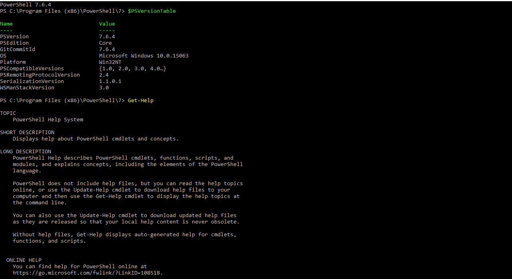

Capture A1a — $PSVersionTable en PowerShell 7.6.4 + Get-Help System (aide intégrée)

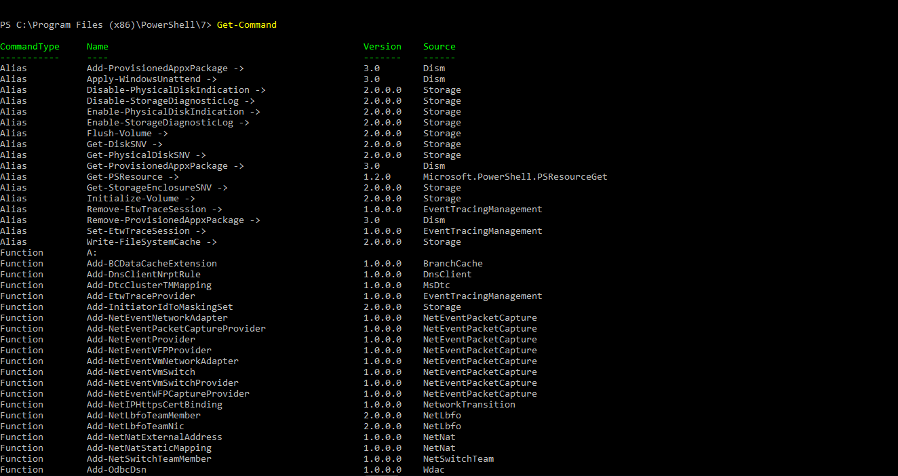

Capture A1b — Get-Command : exploration de l'écosystème complet de cmdlets, alias et functions disponibles

---

## 🧪 Lab B — Gestion d'utilisateurs Windows locaux

**Objectif :** créer, lister, supprimer des utilisateurs Windows locaux en batch via PowerShell.

<aside>
⚠️

**Insight majeur — Gotcha PS 7 vs PS 5.1 :** le module `Microsoft.PowerShell.LocalAccounts` (qui contient `New-LocalUser`, `Get-LocalUser`, etc.) est **historique de Windows PowerShell 5.1**. En PS 7, ces cmdlets ne se chargent pas automatiquement et retournent : *« The term 'New-LocalUser' is not recognized as a name of a cmdlet »*.

**Solutions :**

- **Simple** — utiliser Windows PowerShell 5.1 (icône bleue) en admin
- **Avancée (rester en PS 7)** — `Import-Module Microsoft.PowerShell.LocalAccounts -UseWindowsPowerShell`
</aside>

### Commandes exécutées (Windows PowerShell 5.1 admin)

```powershell
# Création batch de 3 utilisateurs de test
1..3 | ForEach-Object {
    $pwd = ConvertTo-SecureString "Test2026!$_" -AsPlainText -Force
    New-LocalUser -Name "test.user$_" -Password $pwd -FullName "Test Utilisateur $_"
}

# Vérification
Get-LocalUser | Where-Object { $_.Name -like "test.user*" } | Format-Table -AutoSize

# Nettoyage (important : ne pas laisser traîner des comptes de test)
"test.user1","test.user2","test.user3" | ForEach-Object { Remove-LocalUser -Name $_ }
```

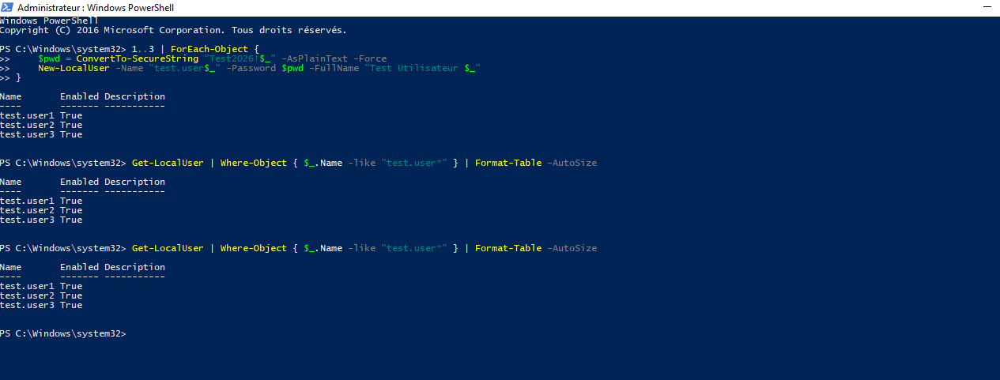

Capture B1 — Création batch réussie de test.user1, test.user2, test.user3 en Windows PowerShell 5.1 admin

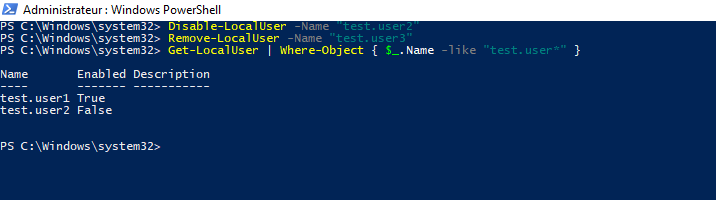

Capture B2 — Démonstration du workflow disable-puis-remove : Disable-LocalUser test.user2 (désactivation) puis Remove-LocalUser test.user3 (suppression)

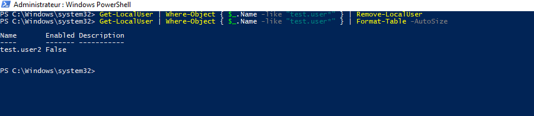

Capture B3 — État final après opérations : test.user2 conservé mais Enabled=False (désactivé). Différence clé entre Disable (compte inactif) et Remove (compte supprimé)

---

## 🧪 Lab C — Import CSV → création batch d'utilisateurs

**Objectif :** automatiser la création d'utilisateurs depuis un fichier CSV. **C'est LE pattern support L2 le plus fréquent** pour onboarding en masse.

### Étape 1 — Création du CSV via here-string

```powershell
@"
Nom,Prenom,Login,Departement,Poste
Martin,Alice,amartin,IT,Support L2
Dupont,Bob,bdupont,RH,Assistant RH
Garcia,Carla,cgarcia,Finance,Comptable
"@ | Out-File -FilePath .\lab-c-users.csv -Encoding UTF8

# Vérifier le contenu
Get-Content .\lab-c-users.csv
```

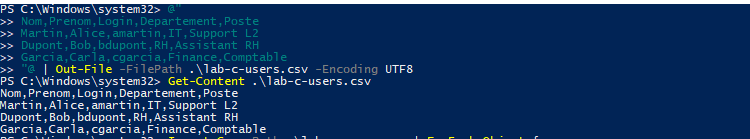

Capture C1 — Création du CSV via here-string @"..."@ + vérification avec Get-Content : header + 3 lignes utilisateurs Martin/Dupont/Garcia

### Étape 2 — Import du CSV et création des utilisateurs

```powershell
Import-Csv -Path .\lab-c-users.csv | ForEach-Object {
    $pwd = ConvertTo-SecureString "Bienvenue2026!" -AsPlainText -Force
    New-LocalUser -Name $_.Login `
        -Password $pwd `
        -FullName "$($_.Prenom) $($_.Nom)" `
        -Description "$($_.Departement) - $($_.Poste)"
    Write-Host "✅ Créé : $($_.Login)" -ForegroundColor Green
}

# Vérification
Get-LocalUser | Where-Object { $_.Name -in @("amartin","bdupont","cgarcia") } | Format-Table -AutoSize
```

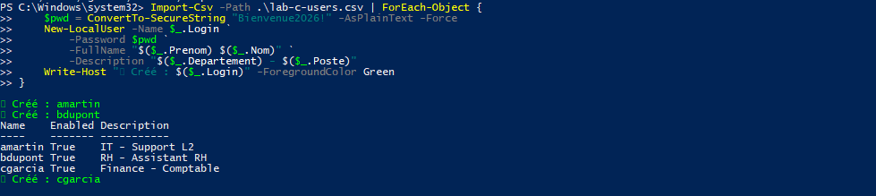

Capture C2 — Import-Csv en pipeline vers ForEach-Object : les 3 utilisateurs amartin, bdupont, cgarcia créés avec confirmation « ✅ Créé » en vert et tableau récapitulatif

### Étape 3 — Nettoyage

```powershell
"amartin","bdupont","cgarcia" | ForEach-Object { Remove-LocalUser -Name $_ }
Get-LocalUser | Where-Object { $_.Name -in @("amartin","bdupont","cgarcia") }  # doit être vide
```

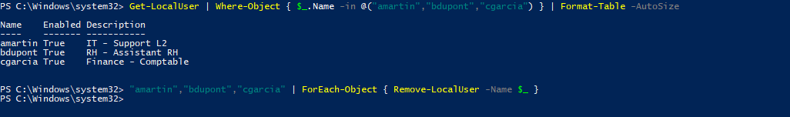

Capture C3a — Vérification Get-LocalUser (les 3 users présents et Enabled=True) puis lancement de Remove-LocalUser en pipeline


Capture C3b — Nettoyage terminé : Remove-LocalUser exécuté sans erreur, retour à l'invite propre (aucun message = succès silencieux)

---

## 🧪 Lab D — Microsoft Graph SDK pour Entra ID

**Objectif :** installer et explorer le SDK **Microsoft.Graph** — la porte d'entrée vers l'administration Entra ID / M365 depuis PowerShell.

<aside>
⚠️

**Insight majeur #1 — TLS 1.2 requis pour PowerShell Gallery :** depuis 2020, PowerShell Gallery exige TLS 1.2. Or Windows PowerShell 5.1 utilise par défaut TLS 1.0 / 1.1 (obsolètes). Résultat : `Install-Module` échoue avec *« NuGet provider is required. Vérifiez votre connexion Internet »* alors que l'internet fonctionne parfaitement.

**Fix :** activer TLS 1.2 dans la session PowerShell avant l'install.

</aside>

### Étape 1 — Fix TLS 1.2 + installation (en Windows PowerShell 5.1 admin)

```powershell
# Activer TLS 1.2 pour cette session
[Net.ServicePointManager]::SecurityProtocol = [Net.ServicePointManager]::SecurityProtocol -bor [Net.SecurityProtocolType]::Tls12

# Installer Microsoft.Graph (~600 Mo, ~40 sous-modules)
Install-Module Microsoft.Graph -Scope CurrentUser -Force -AllowClobber
```

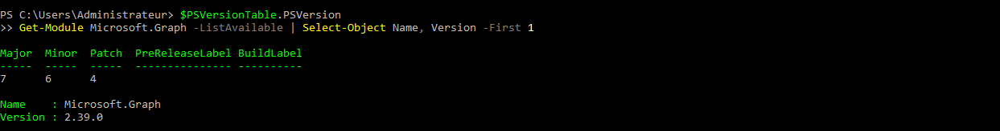

Capture D1 — Résultat après tout le parcours d'installation : $PSVersionTable.PSVersion confirme PowerShell 7.6.4 + Get-Module Microsoft.Graph -ListAvailable montre la version 2.39.0 installée avec succès

<aside>
⚠️

**Insight majeur #2 — Microsoft.Graph 2.x exige PowerShell 7 :** le SDK Microsoft.Graph v2.x dépend de **.NET Standard 2.0**, disponible nativement en PowerShell 7 mais pas en Windows PowerShell 5.1. En PS 5.1, `Import-Module Microsoft.Graph.Users` échoue avec *« Impossible de charger l'assembly 'netstandard, Version=2.0.0.0' »*.

**Fix :** basculer sur PowerShell 7 (icône noire) et réinstaller le module là-bas (chemins de modules distincts entre PS 5.1 et PS 7).

</aside>

### Étape 2 — Réinstallation en PowerShell 7 + exploration

```powershell
# Vérifier qu'on est bien en PS 7
$PSVersionTable.PSVersion  # Doit afficher Major : 7

# Réinstaller dans le path de PS 7
Install-Module Microsoft.Graph -Scope CurrentUser -Force -AllowClobber

# Ajuster l'ExecutionPolicy si prompts éditeur non approuvé
Set-ExecutionPolicy -ExecutionPolicy RemoteSigned -Scope CurrentUser -Force

# Charger le sous-module Users
Import-Module Microsoft.Graph.Users

# Compter les cmdlets disponibles
Get-Command -Module Microsoft.Graph.Users | Measure-Object  # → Count : 212

# Explorer la syntaxe (sans se connecter à un tenant)
Get-Help New-MgUser -Examples
```

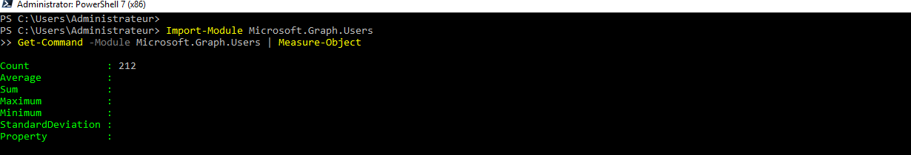

Capture D2 — Import-Module Microsoft.Graph.Users puis Get-Command | Measure-Object : Count 212 cmdlets disponibles pour manipuler les utilisateurs Entra ID depuis PowerShell 7

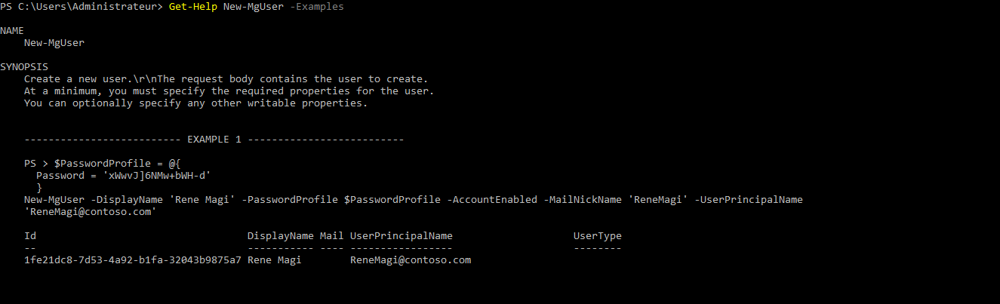

Capture D3 — Get-Help New-MgUser -Examples : documentation intégrée avec exemple complet (utilisateur Rene Magi, PasswordProfile, AccountEnabled, MailNickName, UserPrincipalName). Prêt à être utilisé après connexion à un tenant Entra ID via Connect-MgGraph

---

## 🧪 Lab E — RSAT ActiveDirectory (analyse honnête)

**Objectif tenté :** installer le module PowerShell RSAT pour manipuler Active Directory depuis Windows.

**Constat de terrain :** sur mon poste Windows 10 Pro, l'installation via `Add-WindowsCapability -Online -Name 'Rsat.ActiveDirectory.DS-LDS.Tools~~~~0.0.1.0'` **échoue silencieusement** — la commande retourne `Path : / Online : True / RestartNeeded : False` (faux succès) mais `Get-WindowsCapability` continue de renvoyer `State : NotPresent`.

### Démarche diagnostique

| **Étape** | **Commande** | **Résultat** |
| --- | --- | --- |
| 1. Vérifier l'état réel du composant | `Get-WindowsCapability -Online -Name 'Rsat.ActiveDirectory.*'` | `State : NotPresent` |
| 2. Vérifier la présence des fichiers | `Test-Path "C:\Windows\System32\WindowsPowerShell\v1.0\Modules\ActiveDirectory"` | `False` |
| 3. Vérifier le service Windows Update | `Get-Service wuauserv` | `Status : Stopped` 🚨 |
| 4. Démarrer le service et réessayer | `Start-Service wuauserv` puis relance | Toujours `State : NotPresent` ❌ |

### Conclusion diagnostique

Silent failure de Windows Update, probablement due à :

- Une politique WSUS orphelin ou politique locale interdisant les sources Microsoft directes
- Un état Windows Update corrompu nécessitant `DISM /Online /Cleanup-Image /RestoreHealth` puis `sfc /scannow`
- Un pare-feu / antivirus interceptant les requêtes `windowsupdate.microsoft.com`

<aside>
⚠️

**Capture terminale non disponible** — au moment du diagnostic Lab E, les nombreuses tentatives d'installation successives n'ont pas été capturées visuellement. Le comportement observé (`State : NotPresent` malgré `Add-WindowsCapability` renvoyant `Online : True / RestartNeeded : False`) est intégralement retranscrit dans le tableau de diagnostic ci-dessus. Cette absence de capture est cohérente avec le nature même du bug : une silent failure de Windows Update qui, précisément, n'affiche rien d'anormal.

</aside>

<aside>
🎓

**Ce que ce lab démontre en entretien :** la capacité à **diagnostiquer méthodiquement une silent failure Windows** (vérification de l'état réel vs message de retour, chaine des dépendances système), la **connaissance des commandes de réparation WU** (`DISM /RestoreHealth`, `sfc /scannow`), et la maîtrise de **quand escalader** un ticket vers l'équipe infra pour investigation des logs `CBS.log` et `WindowsUpdate.log`.

</aside>

---

## 🎓 Compétences pratiques démontrées

- ✅ Découverte de l'écosystème PowerShell (structure verbe-nom, pipeline, aide intégrée)
- ✅ Gestion d'utilisateurs Windows locaux via module `LocalAccounts`
- ✅ **Automation par lot depuis CSV** (pattern support L2 le plus fréquent)
- ✅ **Configuration de l'environnement PowerShell** : `TLS 1.2`, `ExecutionPolicy RemoteSigned`, `PSModulePath`
- ✅ **Compréhension du paradoxe PS 5.1 vs PS 7** : LocalAccounts (5.1) vs Microsoft.Graph (7)
- ✅ Manipulation du **SDK Microsoft.Graph** (porte Entra ID / M365)
- ✅ **Diagnostic méthodique** d'une silent failure Windows Update (Lab E)
- ✅ Documentation technique honnête : reconnaître ce qui n'a pas fonctionné et pourquoi

---

## 🔗 Ressources associées

- **Fiche 3 — PowerShell pour l'IAM** : couvre la théorie complète (verbes, pipeline, Microsoft.Graph, RSAT, best practices sécurité)
- **Fiche 1 — Entra ID cycle de vie** : contexte cloud IAM Microsoft
- **Fiche 2 — Active Directory** : contexte on-premise pour comprendre l'AD que RSAT vise à gérer
- **Fiche 4 — MFA & Conditional Access** : la couche sécurité au-dessus des identités créées dans ce lab

---

<aside>
🎯

**Bilan :** 4 labs pratiques validés sur environnement local + 1 lab d'analyse honnête = un socle de compétences PowerShell IAM concret et vérifiable, sans dépendance à un abonnement M365 payant. Chaque insight (TLS 1.2, PS 5.1 vs 7, silent failure WU) est un point d'entretien exploitable.

</aside>
